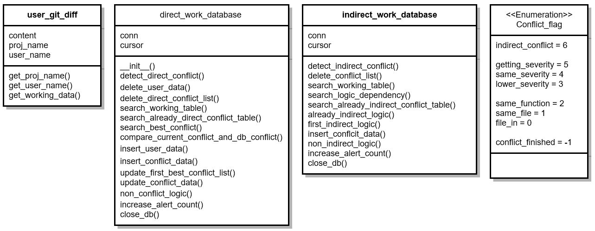

# Conflict Detect Chatbot - Sayme

## Purpose of Project

We aim to improve developer's collaboration environment. We develop a chatbot which can detect python code conflicts automatically in real time and send the conflict information to people who are in conflict through slack.

## Bot's functional features

1. Detect direct conflict : Sayme can detect direct conflict and three types of severity.
2. Detect indirect conflict : Sayme can detect indirect conflict.
3. Ignore file : It functions like gitignore. A user can customize his/her ignore files.
4. Lock file : A user can lock his/her files. If other users try to modify the locked file, Sayme gives them a warning.
5. Check code history : A user can ask who wrote certain code lines.
6. Ignore alarm : A user can ignore direct alarm and indirect alarm.
7. Check conflict possibility : Before a user starts to work, the user can check whether editing certain file generates conflict or not.
8. Check working status : A user can ask about other user's working status
9. Give channel message : A user can let chatbot give a message to channel.
10. Give user message : A user can let chatbot give a message to other users.
11. Give recommendation : A user can ask chatbot to recommend how to deal with the conflict.
12. Recognize user : Chatbot knows when last time a user connected is, so bot can greet the user with time information. ex) It's been a week~!
13. Greet user : Chatbot can greet users.
14. Complimentary close : Chatbot can say good bye.

## Bot's non functional features

## installation

## Demo Vedio

## Future Work
1. Research about how chatbot talk to people in various ways.
2. Increase chatbot's recognition rate about human language to make better interaction between people and chatbot.
3. Adopt voice Recognition : Chatbot can recognize people's voice, and chatbot can response to voice.

Definition of conflict
----------------------

### Definition of direct conflict

다이렉트 컨플릭트란 두명의 사용자(프로그래머)가 깃허브에 저장된 프로젝트의 파일 중에서 같은 파일을 수정할 때 발생하는 컨플릭트를 말한다. 다이렉트 컨플릭트의 종류는 같은 함수를 수정하는 경우, 같은 클래스의 같은 함수를 수정하는 경우, 같은 클래스를 수정하는 경우, 같은 파일 안에서 수정하는 경우 총 3가지로 구성된다. 우리는 같은 함수를 수정하는 경우와 같은 클래스의 같은 함수를 수정하는 경우를 위험도가 가장 높은 상황으로 정의했다. 그다음으로 같은 클래스를 수정하는 경우를 두번째로 위험도가 높은 상황으로 정의했다. 마지막으로 같은 파일에서만 수정하는 경우에는 가장 낮은 위험도로 정의했다.<br>

Direct conflict is a conflict that occurs when two users (programmers) modify the same file in a project file stored in the destination hub. The types of direct conflicts are following: modifying the same function, modifying the same function in the same class, modifying the same class, and modifying code lines in the same file. We define modifying the same function as the riskiest situation such as modifying the same function in the same class. Next, we define modifying the same class as the second riskiest situation and modifying code lines in the same file as the least risky situation.<br>

<br>

### Definition of indirect conflict

인다이렉트 컨플릭트란 두명의 사용자(프로그래머)가 깃허브에 저장된 프로젝트의 파일 중에서 디펜던시를 갖는 함수나 클래스를 서로 수정할 때 발생하는 컨플릭트를 말한다. 디펜던시를 갖는 함수나 클래스란 한 함수나 클래스에서 다른 함수나 클래스의 모듈을 import 할 때 두 개의 함수나 클래스 사이에서 생기는 관계를 말한다. 우리는 함수와 클래스간의 관계를 그래프로 그리고, 노드 간의 길이를 계산하는 알고리즘을 이용해서 길이가 높아지면 위험도가 낮아지고 길이가 낮아지면 위험도가 높아지는 것으로 정의했다.<br>

Indirect Conflict is a conflict that occurs when two users (programmers) modify a function or a class with dependencies among files of a project stored in the hub. "A function or a class with dependencies" refers to the relationship between two functions or classes when importing one function or class module from another function or class. We draw a graph of the relationship between a function and a class, and use an algorithm that computes the length between nodes. The short length means a high risk while the long length means a low risk.

<br>

Structure of conflict detector
------------------------------

### Platform architecture

<div align="center">

</div>

<br>

### Class diagram

<div align="center">

</div>

<br>

### Sequence diagram

<div align="center">

</div>

<br>

How to detect conflict
----------------------

### Analysis about the information of git-diff

우리가 git bash에서 보는 git-diff 정보는 아래와 같다. <br> 우리는 git diff 정보의 첫 줄로부터 사용자가 어떤 파일을 수정했는지 확인할 수 있다. <br> 또한 우리는 git diff 정보의 6번째 줄로부터 과거 파일의 수정된 부분과 현재 파일의 수정된 부분을 확인할 수 있다. <br> 마지막으로 우리는 git diff 정보의 9~10번째 줄로부터 어떤 라인이 빠지고(-기호) 어떤 라인이 추가(+기호) 되어졌는지 확인할 수 있다. <br> The information of git diff we can get from git bash is shown below. <br> From the first line of the git diff information, we can see which files a user modified. <br> We can also see the modified part of the past file and the modified part of the current file from the sixth line of the git diff information. <br> Finally, we can see which line is subtracted (- sign) and which line is appended (+ sign) from line 9 to line 10 of the git diff information.

```
diff --git a/server_dir/direct_work_database.py b/server_dir/direct_work_database.py
index 07686b7..ff16809 100644

--- a/server_dir/direct_work_database.py
+++ b/server_dir/direct_work_database.py

@@ -3,7 +3,7 @@ import datetime as d
from server_dir.slack_message_sender import *
from server_dir.conflict_flag_enum import Conflict_flag
-class work_database:
+class direct_work_database:
```

<br>

### Process the information of git-diff

우리는 사용자로부터 git diff 정보를 받게 되면 .py를 찾아서 사용자가 수정한 파일명을 받아온다. 우리는 수정한 파일명을 받고 git diff 정보 중에서 @@ 가 있는 라인을 찾고, 사용자가 수정한 라인을 찾는다. @@ 태그 안에 있는 숫자 쌍의 정보는 사용자가 수정한 라인의 위로 3줄 밑으로 3줄 정보이다. 우리는 git diff의 라인 수정 정보를 보고 사용자가 어떤 라인을 수정했는지 알 수 있다. 그리고 우리는 라인 정보의 +기호와 -기호를 세서 어떤 라인이 변화했는지 알 수 있다. 우리는 위의 과정을 통해서 git diff 정보를 서버로 넘겨준다. <br> When we receive the information of git diff from a user, we look for .py and get the file name that the user modified. After getting the modified filename, we look for the line with @@ in the git diff information and find the line that the user modified. The @@ includes a pair of number. The one refers to the information about three upper code lines from the modified code line and the other refers to the information about three lower code lines from the modified code. We can recognize which lines a user modified by checking the line modification information. In addition, we can figure out which lines changed by counting the + and - signs from the line information. We pass the git diff information to the server through these process.

<br>

Algorithms of detecting conflict
--------------------------------

### Preprocessing of Project

1.	Python 라이브러리중 [`ast`](https://docs.python.org/3/library/ast.html)를 이용해서 파이썬 파일을 다음과 같은 형태로 파싱 한다.
	1.	`type` : `Function`, `Class` 그리고 `Call` 타입으로 분류 되며 각각은 함수, 클래스 그리고 피호출자를 의미 한다.
	2.	`name` : 해당 타입의 이름을 저장한다.
	3.	`start`, `end` : 함수와 클래스의 경우 해당 로직(함수와 클래스)의 시작과 끝을 의미 한다.
	4.	`members` : 함수와 클래스안에 있는 `Function`, `Class` 그리고 `Call` 타입을 저장 한다.
2.	파싱한 결과로 부터 각 로직간의 관계를 구해서 edge list 형태로 저장한다.
3.	edge list를 [Floyd-Warshall](https://en.wikipedia.org/wiki/Floyd%E2%80%93Warshall_algorithm)를 이용해 각 로직간의 거리를 측정 한다.

### Preprocessing of Project

1.	We parse Python files into the following form using ['ast'] among Python libraries (https://docs.python.org/3/library/ast.html).

	\`\`\`

	1.	'type': There are 'Function', 'Class', and 'Call' and each represents function, class, and callee respectively.
	2.	'name' : It stores the name of corresponding type.
	3.	'start' and 'end' : They mean the beginning and end of the corresponding logic (function and class) for a function and class.
	4.	'members' : It stores 'Function', 'Class' and 'Call' types which are in functions and classes.\`\`\`

2.	We obtain the relationship between each logic from the parsing results and store it in the form of edge list.

3.	We measure the distance between logics using [Floyd-Warshall](https://en.wikipedia.org/wiki/Floyd%E2%80%93Warshall_algorithm)

#### Result Of Parsing

```javascript
conflict_test/counting_triangle.py : [
    {
        "type": "Function",
        "name": "run",
        "start": 5,
        "end": 34,
        "members": [
            {
                "type": "Call",
                "id": "dict"
            },
            {
                "type": "Call",
                "id": "sqrt"
            },
            {
                "type": "Call",
                "id": "byeongal_math.SquareMatrix.SquareMatrix"
            },
            {
                "type": "Call",
                "id": "byeongal_math.SquareMatrix.SquareMatrix.set_value"
            },
            {
                "type": "Call",
                "id": "byeongal_math.SquareMatrix.SquareMatrix.set_value"
            },
            {
                "type": "Call",
                "id": "byeongal_math.SquareMatrix.SquareMatrix.get_lower"
            },
            {
                "type": "Call",
                "id": "byeongal_math.SquareMatrix.SquareMatrix.get_upper"
            },
            {
                "type": "Call",
                "id": "print"
            }
        ]
    },
    {
        "type": "Call",
        "id": "run"
    }
]
```

### Algorithm of detecting direct conflict

1.	알람 카운트가 2 이상이고 24시간 이상인 다이렉트 컨플릭트 리스트를 데이터베이스에서 삭제한다.
2.	프로젝트 이름과 현재 유저의 작업 정보를 이용해서 워킹 정보가 겹치는 다른 유저가 있는지 확인한다.

	1.	프로젝트 이름과 작업 파일이 겹치는 유저 정보가 있음 (다이렉트 컨플릭트)

		1.	현재 다이렉트 컨플릭트 정보를 이용해서 다이렉트 컨플릭트 테이블에 기존의 다이렉트 컨플릭트 정보가 있는지 확인한다.

			1.	기존의 다이렉트 컨플릭트 정보가 있음 (Already Direct Conflict)

				1.	현재 유저와 다른 유저랑 발생한 다이렉트 컨플릭트 정보 중에서 가장 위험도가 높은 다이렉트 컨플릭트 정보를 가져온다.
				2.	현재 다이렉트 컨플릭트 정보와 데이터베이스에 있는 다이렉트 컨플릭트 정보를 비교해서 위험도에 따른 알람을 사용자에게 해준다.
				3.	현재 다이렉트 컨플릭트 정보를 데이터베이스에 업데이트한다.

			2.	기존의 다이렉트 컨플릭트 정보가 없음 (First Direct Conflict)

				1.	현재 유저와 다른 유저랑 발생한 다이렉트 컨플릭트 정보 중에서 가장 위험도가 높은 다이렉트 컨플릭트 정보를 가져온다.
				2.	사용자에게 다이렉트 컨플릭트 정보를 알려준다.
				3.	현재 다이렉트 컨플릭트 정보를 데이터베이스에 삽입한다.

	2.	프로젝트 이름과 작업 파일이 겹치는 유저 정보가 없음 (non- direct conflict)

		1.	컨플릭트 테이블에서 현재 유저의 정보가 있는지 확인한다.
		2.	컨플릭트 테이블에서 현재 유저의 정보가 있음
			1.	해당 사용자들에게 다이렉트 컨플릭트가 해결되었다고 알려준다.
		3.	현재 다이렉트 컨플릭트 테이블에서 사용자와 관련된 모든 다이렉트 컨플릭트 정보를 삭제한다.

<br>

### Algorithm of detecting direct conflict

1.	We delete the direct conflict list from the database when an alarm count is over 2 and the amount of time is over 24 hours.
2.	We check if there is another user whose working status overlaps with a current user using the project name and job information of the current user

	1.	The user information where project name and working file overlap exists (direct conflict)

		1.	We check if there is direct conflict information in the direct conflict table using the current direct conflict information.

			1.	Direct Conflict information is in the table.

				1.	We bring the riskiest direct conflict information among the direct conflict information that occurred between the current user and other users.
				2.	We compare the current direct conflict information and the direct conflict information in the database, and give the user an alert according to the risk.
				3.	We update the current direct conflict information to the database.

			2.	Direct conflict information is not in the table(First Direct Conflict)

				1.	We bring the riskiest direct conflict information among the direct conflict information that occurred between the current user and other users.
				2.	We inform the direct conflict information to the user.
				3.	We insert the current direct conflict information into the database.

	2.	The user information where project name and working file overlap doesn't exist (non-direct conflict)

		1.	We check if there is current user's information in the conflict table.
		2.	There is current user's information in the conflict table.
			1.	We let users know that the direct conflict has been resolved.
		3.	We delete all direct conflict information related to the user in the current direct conflict table.

<br>

### Algorithm of detecting indirect conflict

1.	알람 카운트가 2 이상이고 24시간 이상인 인다이렉트 컨플릭트 리스트를 데이터베이스에서 삭제한다.
2.	데이터베이스의 작업 테이블에서 현재 유저의 프로젝트 이름과 같은 다른 유저가 있는지 확인한다.
3.	현재 유저의 프로젝트 이름, 현재 유저의 작업 내역과 프로젝트 이름이 같은 다른 유저의 작업 내역을 이용해서 데이터베이스의 logic dependency 테이블에 검색을 한다.

	1.	현재 유저의 작업 내역과 다른 유저의 작업이 데이터베이스의 logic dependency 테이블에 의해서 연결이 됨 (indirect conflict)

		1.	현재 인다이렉트 컨플릭트 정보를 이용해서 데이터베이스의 인다이렉트 컨플릭트 테이블을 조사한다.

			1.	이미 인다이렉트 컨플릭트 정보가 존재함.

				1.	현재 인다이렉트 컨플릭트 정보의 알람 카운트가 1이고 30분 이상일 때, 사용자에게 인다이렉트 컨플릭트 정보를 알려준다.
				2.	현재 인다이렉트 컨플릭트 정보를 데이터베이스에 업데이트한다.

			2.	인다이렉트 정보가 존재하지 않음. (First indirect conflict)

				1.	사용자에게 인다이렉트 컨플릭트 정보를 알려준다.
				2.	현재 인다이렉트 컨플릭트 정보를 데이터베이스에 업데이트한다.

	2.	현재 유저의 작업 내역과 다른 유저의 작업이 데이터베이스의 logic dependency 테이블에 의해서 연결이 안 됨 (non-indirect conflict)

		1.	인다이렉트 테이블에 현재 유저 정보가 있는지 확인한다.
		2.	인다이렉트 테이블에 현재 유저 정보가 있음
			1.	사용자들에게 인다이렉트 컨플릭트가 해결됬다는 것을 알려준다.
		3.	인다이렉트 테이블에서 현재 유저 정보의 데이터를 삭제한다.

### Algorithm of detecting indirect conflict

1.	We delete the indirect conflict list from the database when an alarm count is over 2 and the amount of time is over 24 hours.

2.	We check if there is another user whose project name is same with the one of the current user from the working table in the database.

3.	We look up the logic dependency table in the database using the current user's project name, and another user's working history whose project name and working history are same with the current user's.

	1.	The current user's working history and another user's working history are connected by the dependency table in the database (indirect conflict).

		1.	We go over the indirect conflict table in the database using the current indirect conflict information.

		2.	Indirect conflict information already exists.

			1.	If an alarm count of current indirect conflict information is 1 and the amount of time is more than 30 minutes, we let the user know about the indirect conflict information.
			2.	We update the current indirect conflict information to the database.

		3.	Indirect information does not exist. (First indirect conflict)

			1.	We let the user know about the indirect conflict information.
			2.	We update the current indirect conflict information to the database.

	2.	The current user's working history and another user's working history are not connected by the dependency table in the database (non-indirect conflict).

		1.	We make it sure if the indirect table contains the information about the current user.
		2.	Direct table has the information about the current user.
			1.	We let the users know that the indirect conflict has been resolved.
		3.	We delete the data of current user from the indirect table.

<br>

Natural Language Processing
---------------------------

### Requirement

-	nltk
-	stanfordCoreNLP
-	spacy

### Preprocessing of the sentence

To improve the quality of Natural Language Processing, we simplify the sentence. We omit "please" and "I think" from the sentence, because they are not necessary in understanding the sentence. We also replace "have to" and "don't have to" with "should" and "should not". When we detect if the sentence is suggestion or not, we use "MD" part of speech tag. The two words, "have to" and "dont't have to", have same meaning with "should" and "should not", however, they are not regarded as "MD" part of speech tag.

### Classification of the sentence

We have five categories to classify the input sentence; question, command, suggestion, desire and conversation. We classify the input sentence by using following rules.

-	question: a sentence with "SBARQ" or "SQ" parse component.
-	command: a sentence starting with "VB" part of speech tag
-	suggestion: a sentence with "MD" part of speech tag
-	desire: a sentence with a certain verb which contains a meaning of desire
-	conversation: a sentence which doesn't correspond to above

### Classification of the intention

There are nine functions that chatbot can provide to users. We have four lists of categories (question, command, suggestion, and desire) and each consists of nine sentences which represent the function. We understand the category of the input sentence after classifying the sentence. Therefore, in this phrase, we go over the nine sentences of the certain category and compare the similarity with the input sentence.

### Extraction of attention words

Based on the classification of the intention, we extract information from the user to provide the output which the user is looking for. After the extraction, we call another function to respond to the user.

### Sequence diagram(NLP)

<div align="center">

</div>
